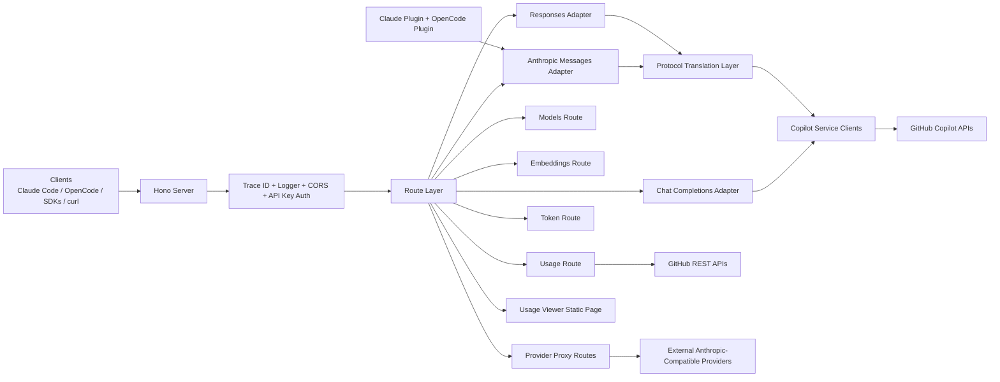
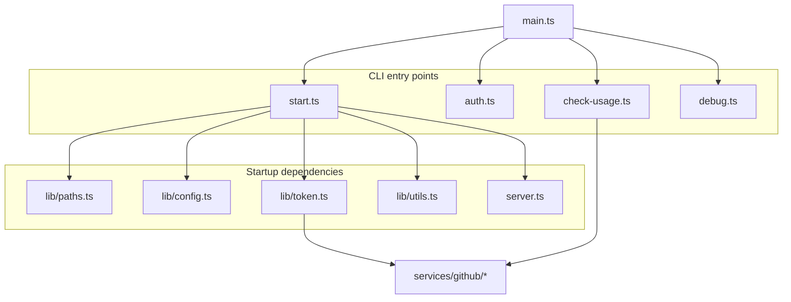
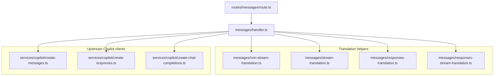
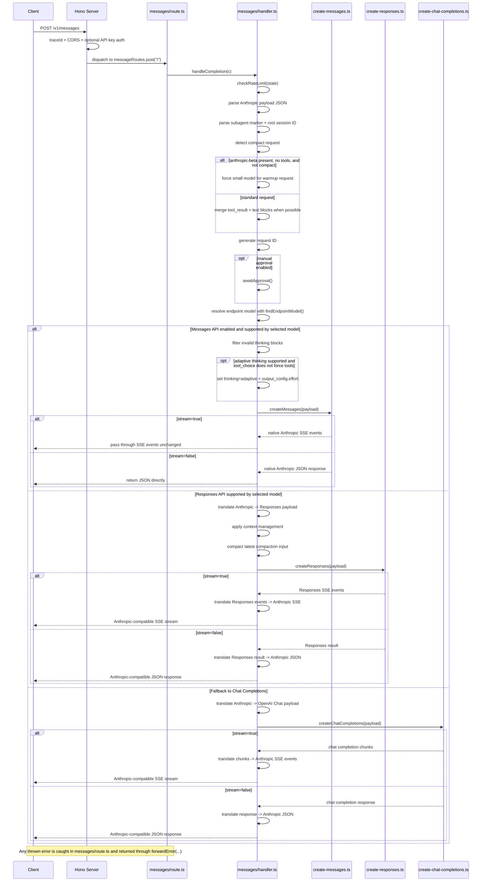
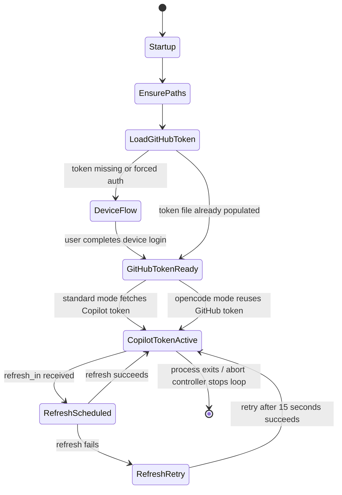
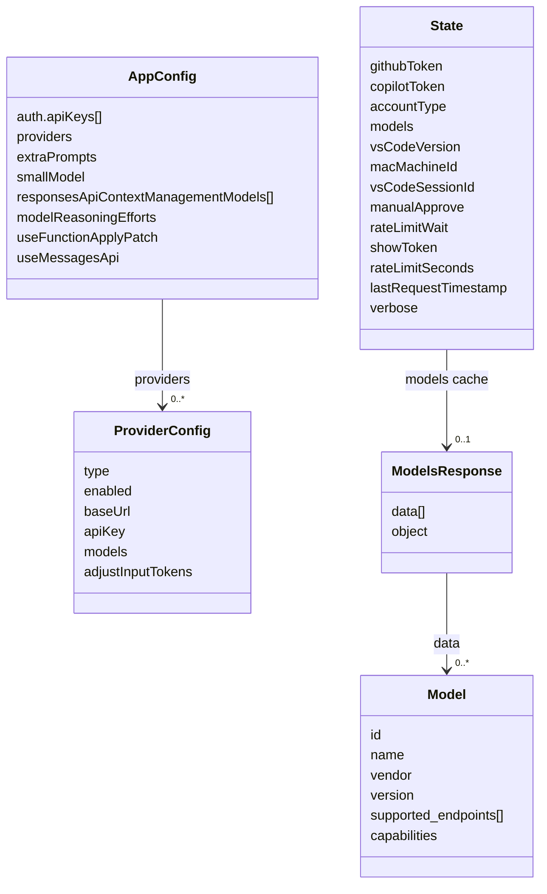

# Copilot API System Wiki

> Last verified against the repository source tree on 2026-03-18.

This document describes the current implementation of `@jeffreycao/copilot-api`. The content is derived from the repository source code, configuration, tests, and deployment assets rather than from assumed platform behavior.

## Table of Contents

- [1. System Overview](#1-system-overview)
- [2. Architecture Design](#2-architecture-design)
- [3. Technology Stack](#3-technology-stack)
- [4. Modules and Components](#4-modules-and-components)
- [5. Data Design](#5-data-design)
- [6. API Documentation](#6-api-documentation)
- [7. Configuration Management](#7-configuration-management)
- [8. Development Guide](#8-development-guide)

## 1. System Overview

### 1.1 Project Summary and Business Context

`copilot-api` is a local or self-hosted proxy that turns GitHub Copilot into a service that can be consumed by:

- OpenAI-compatible clients (`/chat/completions`, `/responses`, `/models`, `/embeddings`)
- Anthropic-compatible clients (`/v1/messages`, `/v1/messages/count_tokens`)
- Coding agents such as Claude Code and OpenCode

The project exists to bridge protocol differences between GitHub Copilot's native APIs and tooling ecosystems that expect OpenAI or Anthropic semantics. It is especially optimized for coding-agent workflows where tool calls, thinking blocks, resumed sessions, compact requests, warmup traffic, and subagent traffic influence both behavior and premium-request consumption.

### 1.2 Core Features

- Exposes GitHub Copilot as OpenAI-compatible and Anthropic-compatible APIs
- Dynamically routes Anthropic-style requests to Copilot's native `/v1/messages`, `/responses`, or `/chat/completions` depending on model capabilities
- Preserves Anthropic-style tool use, tool results, and thinking semantics whenever possible
- Reduces unnecessary premium usage with `smallModel` routing, compact-request handling, and tool-result merging
- Supports phase-aware `gpt-5.3-codex` and `gpt-5.4` commentary/final-answer behavior via built-in prompt injection
- Provides an optional usage dashboard (`/usage-viewer`) and JSON usage endpoint (`/usage`)
- Supports manual approval and request-level rate limiting for generation routes
- Supports optional provider-scoped Anthropic proxy routes such as `/:provider/v1/messages`
- Integrates optional Claude Code and OpenCode subagent marker plugins

### 1.3 Architecture At a Glance



### 1.4 Technology Snapshot

| Area | Current Implementation |
| --- | --- |
| Language | TypeScript with strict compiler settings |
| Runtime | Bun-first development workflow, Node-targeted build output |
| CLI | `citty` |
| HTTP framework | `hono` |
| HTTP serving | `srvx` |
| Streaming | Server-Sent Events via `hono/streaming` and `fetch-event-stream` |
| Upstream HTTP client | `fetch` plus `undici` proxy support |
| Validation / schema typing | TypeScript interfaces, `zod` in tests |
| Token counting | `gpt-tokenizer` |
| Logging | `consola`, Hono logger, per-handler log files |
| Persistence | Local filesystem only |
| Database | None |

### 1.5 Repository Structure

The following tree focuses on directories that are active parts of the runtime or operational workflow.

```text
.
|- src/
|  |- main.ts                  # CLI entrypoint and subcommand registration
|  |- start.ts                 # Runtime bootstrap and server start
|  |- server.ts                # Hono server and route mounting
|  |- auth.ts                  # Standalone authentication command
|  |- check-usage.ts           # CLI usage report command
|  |- debug.ts                 # Runtime/path diagnostics command
|  |- lib/                     # Shared config, state, auth, logging, tracing, utils
|  |- routes/                  # HTTP route handlers and protocol translation
|  `- services/                # GitHub, Copilot, and provider HTTP clients
|- pages/
|  `- index.html               # Static usage dashboard
|- tests/                      # Bun test suite focused on translation and middleware behavior
|- claude-plugin/              # Optional Claude Code subagent marker plugin
|- .claude-plugin/             # Marketplace catalog for the Claude plugin
|- .opencode/plugins/          # Optional OpenCode subagent marker plugin
|- Dockerfile                  # Multi-stage container image
|- entrypoint.sh               # Container startup entrypoint
|- start.bat                   # Windows convenience launcher for dev + dashboard
|- tsdown.config.ts            # Build configuration
|- eslint.config.js            # Lint configuration
`- package.json                # Dependency and script definitions
```

Notes:

- `dist/` is generated build output
- `node_modules/` is dependency installation state
- `vscode-extension/` currently contains only dependency artifacts and is not part of the active runtime described here

## 2. Architecture Design

### 2.1 Architectural Pattern

The system is a **monolithic, layered proxy/adapter service**:

1. **CLI bootstrap layer** initializes paths, config, tokens, runtime state, and server startup
2. **HTTP gateway layer** handles CORS, request tracing, logging, and optional API-key authentication
3. **Protocol adaptation layer** translates between Anthropic Messages, OpenAI Chat Completions, and OpenAI Responses semantics
4. **Upstream client layer** calls GitHub, GitHub Copilot, and optional external Anthropic-compatible providers
5. **Local persistence/state layer** stores tokens, config, daily logs, and in-memory caches

This is not a microservice system. There is no service discovery, message broker, relational database, or distributed cache.

### 2.2 Detailed Component Relationship Diagram

The original relationship map is split into focused views below, and labels use short relative paths so the structure stays readable in Markdown renderers.

#### CLI Startup and Shared Runtime



#### Server Route Registration and Primary Entry Points

```mermaid
flowchart TB
    Server[server.ts]

    subgraph Middleware[Global middleware]
        direction LR
        AuthMW[lib/request-auth.ts]
        TraceMW[lib/trace.ts]
        LoggerMW[hono/logger]
        CorsMW[hono/cors]
    end

    subgraph MountedRoutes[Mounted route groups]
        direction TB
        RootRoutes["/ and /usage-viewer"]
        ChatRoutes["/chat/completions<br/>/v1/chat/completions"]
        ModelsRoutes["/models<br/>/v1/models"]
        EmbeddingsRoutes["/embeddings<br/>/v1/embeddings"]
        UsageRoutes["/usage"]
        TokenRoutes["/token"]
        ResponsesRoutes["/responses<br/>/v1/responses"]
        MessagesRoutes["/v1/messages"]
        ProviderMessages["/:provider/v1/messages"]
        ProviderModels["/:provider/v1/models"]
    end

    subgraph PrimaryTargets[Primary handlers or state]
        direction TB
        RootHandlers[inline handlers in server.ts]
        ChatEntry["routes/chat-completions/route.ts<br/>-> chat-completions/handler.ts"]
        ModelsEntry["routes/models/route.ts<br/>-> state.models + cacheModels()"]
        EmbeddingsEntry["routes/embeddings/route.ts<br/>-> create-embeddings.ts"]
        UsageEntry["routes/usage/route.ts<br/>-> get-copilot-usage.ts"]
        TokenEntry["routes/token/route.ts<br/>-> state.copilotToken"]
        ResponsesEntry["routes/responses/route.ts<br/>-> responses/handler.ts"]
        MessagesEntry["routes/messages/route.ts<br/>-> messages/handler.ts"]
        ProviderMessagesEntry["routes/provider/messages/route.ts<br/>-> provider/messages/handler.ts"]
        ProviderModelsEntry["routes/provider/models/route.ts<br/>-> anthropic-proxy.ts"]
    end

    Server --> AuthMW
    Server --> TraceMW
    Server --> LoggerMW
    Server --> CorsMW

    Server --> RootRoutes
    Server --> ChatRoutes
    Server --> ModelsRoutes
    Server --> EmbeddingsRoutes
    Server --> UsageRoutes
    Server --> TokenRoutes
    Server --> ResponsesRoutes
    Server --> MessagesRoutes
    Server --> ProviderMessages
    Server --> ProviderModels

    RootRoutes --> RootHandlers
    ChatRoutes --> ChatEntry
    ModelsRoutes --> ModelsEntry
    EmbeddingsRoutes --> EmbeddingsEntry
    UsageRoutes --> UsageEntry
    TokenRoutes --> TokenEntry
    ResponsesRoutes --> ResponsesEntry
    MessagesRoutes --> MessagesEntry
    ProviderMessages --> ProviderMessagesEntry
    ProviderModels --> ProviderModelsEntry
```



#### `messages` Handler Dependencies



### 2.3 Key Request Sequence: `POST /v1/messages`

`/v1/messages` is the most important route because it first normalizes Anthropic-style input, then selects the best upstream Copilot-compatible endpoint, and finally translates the upstream result back into Anthropic-compatible JSON or SSE.



Key points in this sequence:

1. **Pre-processing is substantial.** Before any upstream call, the handler rate-limits the request, extracts session metadata, detects compact/warmup traffic, optionally rewrites the model, and normalizes mixed `tool_result` + `text` user content.
2. **Endpoint selection is capability-driven.** The route prefers native Messages API when globally enabled and supported by the selected model, otherwise falls back to Responses API, and finally to Chat Completions.
3. **Return-path behavior differs by endpoint.** Messages API can pass Anthropic-compatible output through directly, while Responses and Chat Completions must translate both non-streaming results and streaming events back into Anthropic-compatible shapes.

#### Streaming Translation Core Logic

These two modules are the core event translators used when `/v1/messages` cannot return native Anthropic-compatible streaming output directly.

**`stream-translation.ts` (`/chat/completions` fallback)**

- Maintains `AnthropicStreamState` with `messageStartSent`, the current content block index, open-block flags, and an OpenAI tool-call-index to Anthropic block-index mapping.
- Emits `message_start` exactly once from the first `ChatCompletionChunk`, seeding message metadata and initial token usage.
- Converts normal text deltas into Anthropic text blocks, closing any open thinking or tool block before emitting `content_block_start` + `text_delta`.
- Converts `reasoning_text` and `reasoning_opaque` into Anthropic thinking/signature events, including a compatibility fallback for abnormal Claude chunks where reasoning text arrives while another block is already open.
- Converts OpenAI `tool_calls` deltas into Anthropic `tool_use` blocks and streams function arguments as `input_json_delta` fragments.
- On `finish_reason`, closes the last open block, maps the stop reason to Anthropic semantics, emits final usage in `message_delta`, and then sends `message_stop`.

**`responses-stream-translation.ts` (`/responses` fallback)**

- Maintains `ResponsesStreamState` with the next block index, an `(output_index, content_index)` to block-index map, currently open blocks, per-block delta tracking, and per-function-call state.
- Emits `message_start` from `response.created`, then routes `response.output_text.delta/done` into Anthropic text blocks keyed by output/content index.
- Merges `response.reasoning_summary_text.*`, `reasoning` output items, and `compaction` output items into Anthropic thinking blocks; compaction carriers are encoded into synthetic signatures so they can round-trip later.
- Opens Anthropic `tool_use` blocks for `response.output_item.added` function calls and appends streamed arguments from `response.function_call_arguments.delta/done` as `input_json_delta` fragments.
- Guards against pathological function-call streams by aborting if argument deltas contain more than 20 consecutive whitespace characters, then closes open blocks and emits an Anthropic `error` event.
- On `response.completed` or `response.incomplete`, closes all open blocks and derives the final stop reason and usage through `translateResponsesResultToAnthropic()`; on `response.failed` or raw `error`, it emits Anthropic `error` events instead.

### 2.4 Key State Machine: Authentication and Copilot Token Lifecycle



### 2.5 Request Routing and Decision Rules

The route selection logic in `src/routes/messages/handler.ts` is central to system behavior.

| Condition | Upstream Endpoint | Key Behavior |
| --- | --- | --- |
| Model supports `/v1/messages` and `useMessagesApi` is enabled | Copilot native Messages API | Keeps Anthropic-native behavior, allowed `anthropic-beta` values, adaptive thinking |
| Model supports `/responses` but not native Messages | Copilot Responses API | Translates Anthropic messages into Responses input items and rehydrates Anthropic responses |
| Neither of the above applies | Copilot Chat Completions API | Falls back to OpenAI-compatible translation |

Additional decisions performed before the upstream call:

- Detects subagent markers from `<system-reminder>` content and propagates parent session identity
- Detects compact requests and marks them as agent traffic
- Forces `smallModel` for no-tools Anthropic beta warmup requests to avoid unnecessary premium requests
- Merges mixed `tool_result` + text user blocks to keep resumed tool flows from looking like fresh user turns
- Derives deterministic request IDs and session IDs for Copilot interaction headers

### 2.6 Cross-Cutting Concerns

#### Tracing

- `src/lib/trace.ts` injects `x-trace-id` into every response
- `src/lib/request-context.ts` stores trace context in `AsyncLocalStorage`
- Trace IDs are sanitized; invalid values are replaced with generated IDs
- The trace context survives SSE handlers and is written into per-handler logs

#### Authentication

- Implemented by `src/lib/request-auth.ts`
- Disabled when `auth.apiKeys` is missing or empty
- Accepts either `x-api-key` or `Authorization: Bearer ...`
- Always bypasses `OPTIONS` requests
- Always allows unauthenticated access to `/`, `/usage-viewer`, and `/usage-viewer/`

#### Logging

- Hono request logging is enabled globally
- Route handlers use `createHandlerLogger(...)` from `src/lib/logger.ts`
- Logs are written to `APP_DIR/logs/<handler>-YYYY-MM-DD.log`
- Log retention is 7 days
- Log lines include handler tag, timestamp, log level, and trace ID when available

#### Manual Approval and Rate Limiting

- `manual` approval prompts the operator via `consola.prompt`
- `rate-limit` and `wait` are enforced by `src/lib/rate-limit.ts`
- These checks are used by the main generation handlers (`/chat/completions`, `/responses`, `/v1/messages`)
- They are **not** applied in the models, usage, token, or embeddings routes

## 3. Technology Stack

### 3.1 Language and Runtime

| Item | Version / Mode | Notes |
| --- | --- | --- |
| TypeScript | `^5.9.3` | Strict mode enabled in `tsconfig.json` |
| Module format | ES modules | `"type": "module"` in `package.json` |
| Development runtime | Bun | `bun run dev`, `bun run start`, `bun test` |
| Build target | Node platform, ES2022 | Configured in `tsdown.config.ts` |
| Declared engine | Node `>=20` | Declared in `package.json` |

Practical interpretation:

- Local development assumes Bun
- The bundling target is Node-compatible ESM output
- Some runtime helpers behave differently depending on whether Bun is present

### 3.2 Frameworks and Key Libraries

| Category | Package | Purpose |
| --- | --- | --- |
| CLI | `citty@^0.1.6` | Subcommand parsing and command execution |
| Web framework | `hono@^4.9.9` | Route registration, middleware, request/response abstraction |
| HTTP serving | `srvx@^0.8.9` | Starts the fetch-based server |
| Streaming | `fetch-event-stream@^0.1.5` | Parses upstream SSE streams |
| HTTP client/proxy | `undici@^7.16.0`, `proxy-from-env@^1.1.0` | Optional environment-driven proxy routing |
| Token counting | `gpt-tokenizer@^3.0.1` | Local token estimation for chat/messages/provider count routes |
| Validation/types | `zod@^4.1.11` | Used in tests to validate translation contracts |
| Logging | `consola@^3.4.2` | Console UX, prompts, structured logging |
| Clipboard support | `clipboardy@^5.0.0` | Copies Claude Code launch command to clipboard |
| Invariants | `tiny-invariant@^1.3.3` | Runtime assertions |

### 3.3 Build, Lint, and Test Tooling

| Task | Tooling | Source of Truth |
| --- | --- | --- |
| Build | `tsdown@^0.15.6` | `tsdown.config.ts` |
| Lint | `eslint@^9.37.0` + `@echristian/eslint-config@^0.0.54` | `eslint.config.js` |
| Formatting convention | Prettier-compatible through shared ESLint config | `eslint.config.js` |
| Tests | Bun test runner | `tests/*.test.ts` |

### 3.4 Database, Middleware, and Caching Technologies

#### Database Technology

There is **no database** in the current implementation.

#### Middleware Components

- Hono CORS middleware (`cors()`)
- Hono request logger (`logger()`)
- Custom API-key middleware (`createAuthMiddleware(...)`)
- Custom trace middleware (`traceIdMiddleware`)
- `undici` global dispatcher override for environment-driven proxy routing (Node-oriented path)

#### Caching and State Strategy

- In-memory `state` object for runtime state
- In-memory cached config (`cachedConfig`)
- In-memory cached token encoders in `src/lib/tokenizer.ts`
- In-memory cached Copilot model list (`state.models`)
- Scheduled refresh of VS Code session IDs and Copilot tokens
- Optional Responses API compaction to keep only the latest compaction carrier on follow-up turns

### 3.5 Third-Party Integrations

| External System | Integration Purpose | Implementation |
| --- | --- | --- |
| GitHub OAuth Device Flow | Obtain GitHub access token | `src/services/github/get-device-code.ts`, `src/services/github/poll-access-token.ts` |
| GitHub User API | Display authenticated user | `src/services/github/get-user.ts` |
| GitHub Copilot token API | Exchange GitHub token for Copilot token | `src/services/github/get-copilot-token.ts` |
| GitHub Copilot model API | Discover supported models and endpoints | `src/services/copilot/get-models.ts` |
| GitHub Copilot generation APIs | Chat, Responses, Messages, Embeddings | `src/services/copilot/*.ts` |
| GitHub Copilot usage API | Usage and quota reporting | `src/services/github/get-copilot-usage.ts` |
| External Anthropic-compatible providers | Provider-scoped message/model proxying | `src/services/providers/anthropic-proxy.ts` |
| Claude Code plugin hooks | Subagent marker injection | `claude-plugin/*`, `.claude-plugin/marketplace.json` |
| OpenCode plugin hooks | Subagent marker injection and root session propagation | `.opencode/plugins/subagent-marker.js` |

## 4. Modules and Components

### 4.1 Bootstrap and CLI Commands

| File | Responsibility |
| --- | --- |
| `src/main.ts` | Parses root-level global options, sets environment variables before dynamic imports, registers subcommands |
| `src/start.ts` | Merges config defaults, initializes state, tokens, model cache, usage viewer URL, and starts the HTTP server |
| `src/auth.ts` | Runs standalone GitHub authentication and writes the GitHub token file |
| `src/check-usage.ts` | Fetches and prints GitHub Copilot quota usage in the terminal |
| `src/debug.ts` | Prints runtime info, version, app paths, and whether a token file exists |

Notable design detail: `src/main.ts` parses `--api-home`, `--oauth-app`, and `--enterprise-url` **before** importing other modules. This matters because `src/lib/paths.ts` and `src/lib/api-config.ts` compute paths and URLs at import time.

### 4.2 Server and Middleware Layer

`src/server.ts` creates the Hono app and mounts all routes. The middleware order is:

1. `traceIdMiddleware`
2. Hono `logger()`
3. `cors()`
4. API-key middleware for all paths except the explicitly allowed unauthenticated paths

Mounted routes:

- `/chat/completions`
- `/models`
- `/embeddings`
- `/usage`
- `/token`
- `/responses`
- `/v1/chat/completions`
- `/v1/models`
- `/v1/embeddings`
- `/v1/responses`
- `/v1/messages`
- `/:provider/v1/messages`
- `/:provider/v1/models`

The server also serves `pages/index.html` on `/usage-viewer` and redirects `/usage-viewer/` to `/usage-viewer`.

### 4.3 Route Modules

#### `src/routes/chat-completions/*`

- Accepts OpenAI Chat Completions payloads
- Calculates token counts when the model is known
- Fills `max_tokens` from model limits when missing
- Generates deterministic request and session IDs
- Calls Copilot `/chat/completions`
- Streams SSE back to the client when `stream=true`

#### `src/routes/responses/*`

- Accepts OpenAI Responses payloads
- Rejects models that do not advertise `/responses` support
- Converts custom `apply_patch` tools into OpenAI function tools when enabled by config
- Removes `web_search` tools because Copilot does not support them
- Optionally applies Responses context compaction strategy
- Fixes inconsistent stream item IDs for `@ai-sdk/openai` compatibility

#### `src/routes/messages/*`

- Accepts Anthropic Messages payloads
- Can route to three different upstream Copilot endpoints
- Implements the project's richest translation logic, including:
  - Anthropic-to-OpenAI translation
  - Anthropic-to-Responses translation
  - Chat-stream-to-Anthropic event translation
  - Responses-stream-to-Anthropic event translation
  - compact request handling
  - warmup small-model fallback
  - tool-result merge optimization
  - subagent marker parsing
  - Messages API beta filtering and adaptive-thinking handling

For the native Messages path, the implementation currently allows only these `anthropic-beta` values to pass through:

- `interleaved-thinking-2025-05-14`
- `context-management-2025-06-27`
- `advanced-tool-use-2025-11-20`

It also auto-adds `interleaved-thinking-2025-05-14` when a non-adaptive thinking budget is requested.

#### `src/routes/provider/*`

- Adds provider-scoped Anthropic-compatible routes driven by `config.providers`
- Only `type: "anthropic"` is currently supported
- For messages, applies per-model defaults for `temperature`, `top_p`, and `top_k`
- For models, forwards the upstream response while stripping hop-by-hop headers
- For count-tokens, estimates locally using the shared tokenizer logic

#### `src/routes/models/route.ts`

- Returns Copilot model metadata in an OpenAI-style list envelope
- Adds compatibility fields such as `object`, `type`, `owned_by`, and `display_name`

#### `src/routes/embeddings/route.ts`

- Forwards embedding requests directly to Copilot `/embeddings`

#### `src/routes/usage/route.ts`

- Returns GitHub Copilot usage/quota JSON from GitHub's internal endpoint

#### `src/routes/token/route.ts`

- Returns the current in-memory Copilot token as JSON
- This is operationally useful but highly sensitive

### 4.4 Core Service Clients

| Service Group | Files | Responsibilities |
| --- | --- | --- |
| GitHub auth/identity | `src/services/github/get-device-code.ts`, `poll-access-token.ts`, `get-user.ts` | Device flow login and user lookup |
| GitHub operational data | `src/services/github/get-copilot-token.ts`, `get-copilot-usage.ts` | Copilot token exchange and usage reporting |
| Copilot generation/data | `src/services/copilot/create-chat-completions.ts`, `create-responses.ts`, `create-messages.ts`, `create-embeddings.ts`, `get-models.ts` | Upstream API calls to GitHub Copilot |
| Provider proxy | `src/services/providers/anthropic-proxy.ts` | Forward requests to configured Anthropic-compatible providers |

### 4.5 Core Interfaces and Data Contracts

| Interface | Location | Role |
| --- | --- | --- |
| `AppConfig` | `src/lib/config.ts` | Persistent application configuration schema |
| `ProviderConfig` / `ResolvedProviderConfig` | `src/lib/config.ts` | Provider-scoped routing configuration |
| `State` | `src/lib/state.ts` | In-memory runtime state |
| `Model` | `src/services/copilot/get-models.ts` | Copilot model metadata including supported endpoints and capabilities |
| `AnthropicMessagesPayload` | `src/routes/messages/anthropic-types.ts` | Canonical Anthropic request shape used by the proxy |
| `ResponsesPayload` | `src/services/copilot/create-responses.ts` | Canonical OpenAI Responses request shape used for Copilot `/responses` |
| `ChatCompletionsPayload` | `src/services/copilot/create-chat-completions.ts` | Canonical OpenAI Chat Completions request shape |
| `SubagentMarker` | `src/routes/messages/subagent-marker.ts` | Parsed metadata for subagent-originated traffic |

### 4.6 Key Business Logic Flows

#### Flow A: Anthropic Request Routing

1. Parse the Anthropic request body
2. Extract optional subagent marker and root session ID
3. Detect compact-request patterns from the system prompt
4. If the request is an Anthropic beta warmup with no tools, replace the requested model with `smallModel`
5. Merge mixed `tool_result` and text blocks for resumed tool flows when not compact
6. Normalize/resolve the endpoint model ID against the cached Copilot model list
7. Route to Messages API, Responses API, or Chat Completions based on model support and config
8. Translate streaming or non-streaming results back into Anthropic-compatible output

#### Flow B: Token and Session Bootstrap

1. Ensure app directory, token file, and config file exist
2. Load or acquire a GitHub token
3. Exchange the GitHub token for a Copilot token unless running in `opencode` OAuth mode
4. Start the Copilot token refresh loop
5. Cache Copilot models
6. Cache a VS Code version, machine ID, and session ID to match expected Copilot headers
7. Start the HTTP server and display the usage viewer URL

#### Flow C: Responses API Safety/Compatibility Adjustments

1. Convert custom `apply_patch` tools to function tools when `useFunctionApplyPatch=true`
2. Drop unsupported `web_search` tools
3. Compact the input to the latest compaction carrier if present
4. Optionally inject `context_management` compaction instructions for configured models
5. Force `service_tier=null` because Copilot does not support that field
6. Normalize inconsistent stream item IDs before returning SSE to the client

### 4.7 Extension Points and Plugin Mechanisms

The project has several real extension points:

#### Config-Driven Provider Extensions

- Add providers under `config.providers`
- Each provider name becomes a route prefix such as `/:provider/v1/messages`
- Per-model defaults can be applied for `temperature`, `topP`, and `topK`

#### Prompt and Reasoning Extensions

- `extraPrompts[model]` appends model-specific system guidance
- `modelReasoningEfforts[model]` controls Responses API `reasoning.effort`
- `smallModel` controls fallback routing for tool-less warmup traffic

#### Feature Toggles

- `useMessagesApi` enables/disables native Copilot Messages routing
- `useFunctionApplyPatch` enables/disables automatic `apply_patch` function-tool conversion

#### Subagent Integration Plugins

- `claude-plugin/` implements a `SubagentStart` hook that injects a `__SUBAGENT_MARKER__...` payload
- `.opencode/plugins/subagent-marker.js` tracks parent/child sessions and injects both the marker and `x-session-id`

## 5. Data Design

### 5.1 Database Design

There is **no relational or document database** in the current system.

Instead, the system combines:

- local filesystem persistence for credentials and config
- in-memory runtime state for active tokens, models, and session metadata
- local file-based operational logs

### 5.2 Persistent Artifacts

| Artifact | Default Location | Format | Purpose |
| --- | --- | --- | --- |
| App home directory | `~/.local/share/copilot-api` or `%USERPROFILE%\.local\share\copilot-api` | Directory | Root for local state |
| GitHub token file | `APP_DIR/<oauth-app?>/[ent_]github_token` | Plain text | Stores the GitHub OAuth token |
| Config file | `APP_DIR/config.json` | JSON | Stores auth keys, providers, model behavior toggles |
| Handler logs | `APP_DIR/logs/*.log` | Text | Daily per-handler operational logs |
| Usage viewer page | `pages/index.html` | Static HTML | Local dashboard frontend |

`src/lib/paths.ts` ensures the token and config files exist and attempts to set file permissions to `0600`.

### 5.3 Runtime Data Model



### 5.4 Table Structure / Entity Structure Notes

Since there is no database, there are no SQL tables. The most important persisted and runtime entities are:

| Entity | Kind | Key Fields |
| --- | --- | --- |
| GitHub token | Persisted secret | OAuth token text |
| Copilot token | Runtime secret | token, refresh interval |
| App config | Persisted JSON | API keys, providers, prompts, toggles |
| Runtime state | In-memory object | models, account type, VS Code metadata, rate limit state |
| Copilot model catalog | In-memory cached response | model IDs, supported endpoints, tokenizer, capabilities |

### 5.5 Cache Strategy

| Cache / State | Scope | Behavior |
| --- | --- | --- |
| `cachedConfig` | Process memory | Loaded on first access, refreshed at startup by `mergeConfigWithDefaults()` |
| `state.models` | Process memory | Populated at startup via `cacheModels()` |
| Tokenizer encoder cache | Process memory | Lazy-loaded per tokenizer encoding and reused |
| Copilot token refresh loop | Process memory + timer | Refreshes before expiry; retries every 15 seconds after failure |
| VS Code session ID | Process memory + timer | Rotates periodically with jitter |
| Responses compaction | Request payload transformation | Keeps only the latest compaction item on follow-up requests |

### 5.6 Security-Sensitive Data Notes

- `GET /token` returns the active Copilot token and should not be exposed without authentication
- `--show-token` prints GitHub and Copilot tokens to the console and should be used only in controlled environments
- The usage viewer page itself is public, but it fetches JSON data without adding auth headers
- If API-key auth is enabled, the default `/usage-viewer?endpoint=/usage` flow will not authenticate automatically

## 6. API Documentation

### 6.1 Authentication Rules

All routes except `/`, `/usage-viewer`, and `/usage-viewer/` require authentication **only when** `auth.apiKeys` is configured with one or more non-empty strings.

Accepted request headers:

```http
x-api-key: <api_key>
Authorization: Bearer <api_key>
```

Special cases:

- `OPTIONS` requests always bypass auth
- If no API keys are configured, all routes are effectively open

### 6.2 Endpoint Catalog

| Path | Method | Auth When Keys Exist | Purpose | Notes |
| --- | --- | --- | --- | --- |
| `/` | `GET` | No | Health-like text response | Returns `Server running` |
| `/usage-viewer` | `GET` | No | Static usage dashboard | Serves `pages/index.html` |
| `/chat/completions` | `POST` | Yes | OpenAI Chat Completions adapter | Alias of `/v1/chat/completions` |
| `/v1/chat/completions` | `POST` | Yes | OpenAI Chat Completions adapter | Direct Copilot `/chat/completions` proxy |
| `/models` | `GET` | Yes | OpenAI-style model list | Alias of `/v1/models` |
| `/v1/models` | `GET` | Yes | OpenAI-style model list | Uses cached Copilot models |
| `/embeddings` | `POST` | Yes | Embeddings adapter | Alias of `/v1/embeddings` |
| `/v1/embeddings` | `POST` | Yes | Embeddings adapter | Direct Copilot `/embeddings` pass-through |
| `/responses` | `POST` | Yes | OpenAI Responses adapter | Alias of `/v1/responses` |
| `/v1/responses` | `POST` | Yes | OpenAI Responses adapter | Requires model support for `/responses` |
| `/v1/messages` | `POST` | Yes | Anthropic Messages adapter | Dynamically routes to Messages, Responses, or Chat |
| `/v1/messages/count_tokens` | `POST` | Yes | Anthropic token estimate | Local heuristic, not upstream tokenization |
| `/:provider/v1/messages` | `POST` | Yes | Provider-scoped Anthropic proxy | Requires enabled provider config |
| `/:provider/v1/messages/count_tokens` | `POST` | Yes | Provider-scoped token estimate | Local heuristic |
| `/:provider/v1/models` | `GET` | Yes | Provider-scoped models proxy | Forwards upstream model list |
| `/usage` | `GET` | Yes | Copilot usage and quota JSON | Root path only, no `/v1` alias |
| `/token` | `GET` | Yes | Current Copilot token | Root path only, no `/v1` alias |

### 6.3 Endpoint-Specific Behavior Notes

#### `POST /v1/messages`

- Accepts Anthropic request shape defined in `src/routes/messages/anthropic-types.ts`
- Supports `system`, `messages`, `tools`, `tool_choice`, `thinking`, `metadata`, and streaming
- Resolves the effective upstream route per model capability
- May replace the requested model with `smallModel` for tool-less warmup requests
- Uses `metadata.user_id` and/or `x-session-id` to derive a stable root session ID

#### `POST /v1/messages/count_tokens`

- Converts the request to an OpenAI-style payload first
- Uses local tokenizer heuristics, not GitHub upstream counting
- Adds tool system-prompt estimates for Claude and Grok paths when relevant
- Applies a `1.15` multiplier for Claude-family token estimates
- Returns `{ "input_tokens": 1 }` as a fallback on failure

#### `POST /v1/responses`

- Only works if the selected model advertises `/responses` in `supported_endpoints`
- Converts custom `apply_patch` tools into function tools when enabled
- Removes unsupported `web_search` tools
- Nulls `service_tier`
- Optionally injects `context_management` compaction
- Keeps `parallel_tool_calls=true`, `store=false`, and includes encrypted reasoning content

#### `POST /:provider/v1/messages`

- Applies provider-scoped model defaults from `config.providers.<name>.models`
- Forwards a limited header set, including `anthropic-version` and `anthropic-beta`
- Optionally adjusts `usage.input_tokens` by subtracting cache tokens when `adjustInputTokens=true`

#### `GET /usage`

- Calls GitHub's internal Copilot usage endpoint
- Returns raw usage details including quota snapshots for chat, completions, and premium interactions

#### `GET /token`

- Returns `{ "token": state.copilotToken }`
- This is useful for diagnostics but should be treated as a sensitive endpoint

### 6.4 Error Codes and Error Handling

| HTTP Status | Typical Source | Meaning |
| --- | --- | --- |
| `400` | Responses route | Selected model does not support `/responses` |
| `401` | Auth middleware | Missing or invalid API key |
| `403` | Manual approval flow | Operator rejected the request |
| `404` | Provider routes | Provider missing or disabled |
| `429` | Rate limiting | Request arrived before cooldown expired and `--wait` was not set |
| `500` | Internal error / upstream wrapper | Unexpected error or failed upstream processing |

Error handling behavior details:

- `HTTPError` wraps non-OK upstream responses
- `forwardError(...)` serializes upstream response text into a generic `{ error: { message, type } }` shape
- Provider model routes can also forward upstream status codes directly through `createProviderProxyResponse(...)`

### 6.5 Example Requests

#### List models

```bash
curl http://localhost:4141/v1/models \
  -H "x-api-key: your_api_key"
```

#### Send an Anthropic Messages request

```bash
curl http://localhost:4141/v1/messages \
  -H "content-type: application/json" \
  -H "x-api-key: your_api_key" \
  -d '{
    "model": "claude-sonnet-4.6",
    "max_tokens": 1024,
    "messages": [
      {
        "role": "user",
        "content": "Explain how this proxy chooses an upstream endpoint."
      }
    ]
  }'
```

#### Send an OpenAI Responses request

```bash
curl http://localhost:4141/v1/responses \
  -H "content-type: application/json" \
  -H "x-api-key: your_api_key" \
  -d '{
    "model": "gpt-5.4",
    "input": [
      {
        "type": "message",
        "role": "user",
        "content": "Summarize the current repository structure."
      }
    ]
  }'
```

#### Use a configured provider route

```bash
curl http://localhost:4141/custom/v1/messages \
  -H "content-type: application/json" \
  -H "anthropic-version: 2023-06-01" \
  -H "x-api-key: your_api_key" \
  -d '{
    "model": "kimi-k2.5",
    "max_tokens": 512,
    "messages": [
      {
        "role": "user",
        "content": "Hello from a provider-scoped route."
      }
    ]
  }'
```

## 7. Configuration Management

### 7.1 Environment Variables

| Variable | Purpose | Notes |
| --- | --- | --- |
| `COPILOT_API_HOME` | Overrides the app home directory | Also exposed via `--api-home=<path>` |
| `COPILOT_API_OAUTH_APP` | Selects OAuth app profile | Supports values such as `opencode`; also exposed via `--oauth-app=<id>` |
| `COPILOT_API_ENTERPRISE_URL` | Enables GitHub Enterprise domain handling | Also exposed via `--enterprise-url=<domain>` |
| `GH_TOKEN` | Container startup GitHub token | Used by `entrypoint.sh` to pass `-g` to `start` |
| `HTTP_PROXY`, `HTTPS_PROXY`, `NO_PROXY`, etc. | Optional outbound proxy settings | Only consulted when `--proxy-env` is used; implementation is skipped when running under Bun |

### 7.2 Config File Structure

The config file lives at `APP_DIR/config.json`.

Representative shape based on `src/lib/config.ts`:

```json
{
  "auth": {
    "apiKeys": []
  },
  "providers": {
    "custom": {
      "type": "anthropic",
      "enabled": true,
      "baseUrl": "https://example-provider.local",
      "apiKey": "sk-example",
      "adjustInputTokens": false,
      "models": {
        "kimi-k2.5": {
          "temperature": 1,
          "topP": 0.95,
          "topK": 40
        }
      }
    }
  },
  "extraPrompts": {
    "gpt-5-mini": "<built-in exploration prompt>",
    "gpt-5.3-codex": "<built-in commentary prompt>",
    "gpt-5.4": "<built-in commentary prompt>"
  },
  "smallModel": "gpt-5-mini",
  "responsesApiContextManagementModels": [],
  "modelReasoningEfforts": {
    "gpt-5-mini": "low",
    "gpt-5.3-codex": "xhigh",
    "gpt-5.4": "xhigh"
  },
  "useFunctionApplyPatch": true,
  "useMessagesApi": true
}
```

Config semantics:

- `auth.apiKeys`: enables API-key auth when non-empty
- `providers`: enables provider-scoped Anthropic proxy routes
- `extraPrompts`: per-model prompt injection used mostly in Anthropic-to-Responses translation
- `smallModel`: fallback model for tool-less warmup traffic
- `responsesApiContextManagementModels`: model allowlist for automatic Responses compaction
- `modelReasoningEfforts`: per-model Responses `reasoning.effort`
- `useFunctionApplyPatch`: converts a custom `apply_patch` tool into a function tool schema on the Responses path
- `useMessagesApi`: toggles native Copilot Messages API routing for supported models

### 7.3 CLI Options

#### Root-Level Global Options

These are parsed before dynamic imports and should be passed before the subcommand.

| Option | Purpose |
| --- | --- |
| `--api-home=<path>` | Overrides `COPILOT_API_HOME` |
| `--oauth-app=<id>` | Overrides `COPILOT_API_OAUTH_APP` |
| `--enterprise-url=<domain>` | Overrides `COPILOT_API_ENTERPRISE_URL` |

#### `start` Command Options

| Option | Alias | Default | Purpose |
| --- | --- | --- | --- |
| `--port` | `-p` | `4141` | Listening port |
| `--verbose` | `-v` | `false` | Verbose console logging |
| `--account-type` | `-a` | `individual` | Copilot account family (`individual`, `business`, `enterprise`) |
| `--manual` | - | `false` | Prompt for approval before generation requests |
| `--rate-limit` | `-r` | unset | Cooldown in seconds between generation requests |
| `--wait` | `-w` | `false` | Wait for cooldown instead of returning `429` |
| `--github-token` | `-g` | unset | Use a provided GitHub token instead of device login |
| `--claude-code` | `-c` | `false` | Generate a Claude Code launch command and copy it to the clipboard |
| `--show-token` | - | `false` | Print GitHub and Copilot tokens to the console |
| `--proxy-env` | - | `false` | Initialize HTTP proxy routing from environment variables |

#### Other Commands

| Command | Key Options | Purpose |
| --- | --- | --- |
| `auth` | `--verbose`, `--show-token` | Force GitHub device authentication and save the token |
| `debug` | `--json` | Print version, runtime, paths, and token existence |
| `check-usage` | none | Fetch and print current Copilot quota usage |

### 7.4 Operational Configuration Notes

#### Proxy Environment Caveat

`src/lib/proxy.ts` immediately returns when `Bun` is defined. This means `--proxy-env` is effectively a **Node-oriented path** and does not currently alter behavior when the process is running under Bun.

#### Usage Viewer Caveat

The static page in `pages/index.html` fetches the target endpoint without attaching authentication headers. If API-key auth is enabled, the default `http://localhost:4141/usage` endpoint will reject the request unless you change your exposure model or customize the page.

#### Claude Code Helper Mode

When `--claude-code` is used:

1. The server loads available Copilot models first
2. The operator selects a primary model and a small model interactively
3. The project generates shell-specific environment-variable commands via `src/lib/shell.ts`
4. It tries to copy the launch command to the clipboard

## 8. Development Guide

### 8.1 Build, Run, Lint, and Test Commands

| Task | Command |
| --- | --- |
| Install dependencies | `bun install` |
| Development mode | `bun run dev` |
| Production-style source run | `bun run start` |
| Build output | `bun run build` |
| Lint | `bun run lint` |
| Type check | `bun run typecheck` |
| Run all tests | `bun test` |

Build details from `tsdown.config.ts`:

- Entry: `src/main.ts`
- Format: ESM
- Target: ES2022
- Platform: Node
- Output directory: `dist/`

### 8.2 Local Developer Workflow

1. Install dependencies with `bun install`
2. Authenticate once with `bun run ./src/main.ts auth` or provide `--github-token`
3. Start the server with `bun run dev` or `bun run start`
4. Open the usage viewer or call `/v1/models` to confirm the proxy is healthy
5. Run `bun test` before merging changes that touch translation or middleware behavior

### 8.3 Docker Workflow

The repository includes a multi-stage `Dockerfile`:

- builder stage installs dependencies and runs `bun run build`
- runner stage installs production dependencies only
- `dist/` and `pages/` are copied into the runtime image
- the container exposes port `4141`
- health checks call `http://localhost:4141/`

Container entry behavior from `entrypoint.sh`:

- `--auth` runs `bun run dist/main.js auth`
- otherwise the container runs `bun run dist/main.js start -g "$GH_TOKEN" "$@"`

Example:

```bash
docker build -t copilot-api .

docker run -p 4141:4141 \
  -e GH_TOKEN=your_github_token_here \
  copilot-api
```

### 8.4 Windows Convenience Flow

`start.bat` is a simple local-development helper that:

1. installs dependencies when `node_modules/` is missing
2. opens the usage viewer URL in the default browser
3. runs `bun run dev`

### 8.5 Coding Standards

The repository's active coding standards come from `tsconfig.json`, `eslint.config.js`, and `AGENTS.md`:

- Use ES module syntax
- Prefer `~/*` imports for `src/*`
- Keep TypeScript strict (`strict: true`)
- Avoid unused locals and parameters
- Do not allow switch fallthrough
- Use tests in `tests/*.test.ts`
- Follow the shared ESLint config from `@echristian/eslint-config`

### 8.6 Test Coverage Focus Areas

Current tests emphasize translation correctness and request context behavior:

- Anthropic request translation to Chat Completions
- Chat/Responses translation back into Anthropic responses and SSE events
- Responses stream tool-call argument handling
- Trace ID propagation through normal routes and SSE routes
- CLI root-level global option behavior
- `x-initiator` behavior for chat completions

This means the most confidence currently exists around protocol adaptation and middleware behavior, not around end-to-end integration with live GitHub infrastructure.

### 8.7 Recommended Onboarding Checklist for New Team Members

1. Read `src/start.ts`, `src/server.ts`, and `src/routes/messages/handler.ts` first
2. Review `src/lib/config.ts` and `src/lib/token.ts` to understand runtime state and auth
3. Study `src/routes/messages/responses-translation.ts` and `src/routes/messages/stream-translation.ts` to understand protocol adaptation
4. Inspect `tests/` to see which behaviors are intentionally preserved
5. Configure `config.json` and API keys before exposing the service beyond localhost

